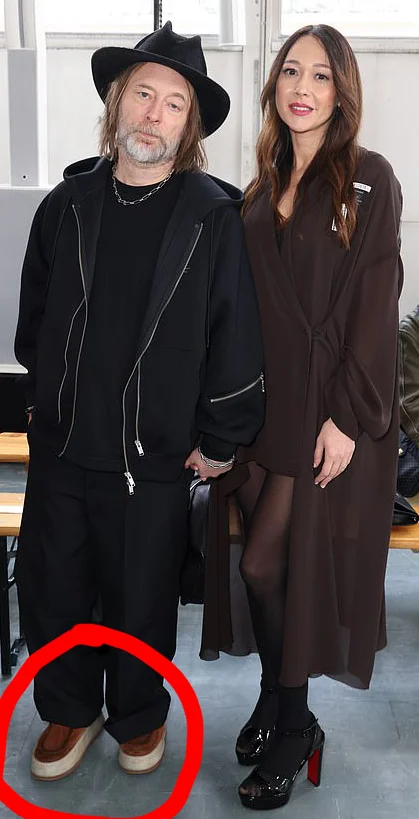

## Background

On May 21, [Thom Yorke gave a speech](https://www.youtube.com/watch?v=6_7DK7aObPM) at the Ivor Novello Awards in London and received the Fellowship of The Ivors Academy (the highest honor they award) for his contribution to music through his excellent work in the bands Radiohead and Atoms for Peace, and *not* for his shitty solo work, nor for most of the music he made while in his latest band, The Smile.

Why did it take me 2 weeks to write this post?  That's life when you have a 1-year-old.

## Climate Change

First off, the speech (which accrued only 78k views on YouTube because I guess it's cool to hate Radiohead again?) was very much what you'd expect from Thom Yorke -- intelligent, wise, thoughtful, accurate... and utterly dickish, in [true Thom Yorke style](https://youtu.be/za_ze85LcBA?t=2).

This time, however, instead of going on about climate change, he spoke to his field of expertise, commenting on the music industry and, by extension, the whole of the entertainment industry.

Before I get to the meat of the speech, I have some things I want to say.

First, I'm really glad that Thom's becoming less of a climate change advocate.  Remember when we all went vegan and thought that soy was good for you?  We were so hilarious.  And now it turns out that climate change is also a hoax, along with recycling.

This is why no one believes in science anymore -- at one point in time, all of the above was "scientifically proven."

Anyway, I'm glad Thom finally grew out of this bullshit, perhaps with the help of his new big boy shoes:

## Radiohead = Dead

Activism aside, during the speech we finally got confirmation of something that we kinda already knew -- that Radiohead quietly broke up and is basically dead.  

Thom even went so far as to not even say the name *Radiohead*, instead referring to it merely as his "old band," perhaps in an attempt to distance himself from it, just like how he's trying to distance himself from the floor with those fucking platform shoes (yes, I'm still on the shoe thing; deal with it).

I guess he's trying to not let Radiohead's legacy eclipse the work he's doing in The Smile (or as I call it, The Frown... because that band's music makes me frown... because it sucks).

What really surprised me, though, was that he didn't even thank Ed, Colin, and Phil specifically.  As an added slap in the face to the "old band," he thanked Jonny by name -- *twice*.  I don't know, maybe he was just nervous and I'm looking into things too much?

Perhaps this all sounds a bit childish, as if Colin went home and bellowed at his brother: "I can't believe Thom said your name twice and didn't even say my name at all!  I hate you!  You're always sucking up to him!  This buddy-buddy shit between the two of you has been going on since Amnesiac and I'm sick of it!"  Yea, not likely.

So I suppose Thom was just nervous and omitted some names in haste.  He definitely didn't seem confident at all and also still seems to be suffering from imposter syndrome, even after all these years.  To his credit, though, he's at least managed to stay pretty humble and grounded, which is hard for a lot people in his position to do.

## The Scathing Critique

Finally getting to the heart of the speech, Thom remarked about how risk-adverse the industry has gotten.  He extrapolates that if this behavior continues, it will lead to the death of the industry itself (streaming included).

I both agree and disagree, but since I've never had a career in the industry myself, permit me to talk out of my ass for a second:

On the one hand, all entertainment industries (movies and shows, too) are indeed getting more risk-adverse.  However, while Gen Z is complaining that they don't have their own cultural identity on account of all the rehashed content, they're still invariably shelling out for such content regardless.

Maybe entertainment industries won't die, but rather, we'll just see a repeat of the movie scene from the 1970s, where the waters were tested with small-scale original movies while the industry took a break from big-budget, end-of-the-world, sci-fi flicks.  This isn't necessarily a bad thing -- this is the era gave us such low-budget masterpieces as Rocky, Halloween, and Taxi Driver, after all.

For the music industry, however, I'm thinking that AI will act as the canary in the coal mine, and that money will subsequently be invested based on what trends develop from AI.

We could also see a return of something akin to the Seattle grunge scene from the 90s, not in the sense that alt rock music will make a comeback, but that more independent bands will spring up as fatigue of over-produced pop music of progressively diminishing quality sets in; basically, a mirroring of what will happen in film.

Ultimately, Thom isn't entirely wrong; the music industry as we currently know it is likely on its deathbed.  However, some new iteration will inevitably force its way forward.  Right now, millions of kids are dreaming of becoming the next big pop star, and are willing to do whatever it takes to get there, even if the landscape of the future makes it harder than ever.  Hasn't this been this case with every generation, though?  Has it ever gotten easier to get famous?  Has the industry ever gotten less competitive, less cutthroat?

And for the rest of us?  We'll be right there waiting to consume whatever they create.  What else are we gonna do with our free time?  Start a blog like a loser?  I don't think so.